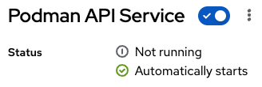

# Custom installation

<ol>
    <li>Fedora Server 40</li>
    <li>Docker using Portainer</li>
    <li>Podman to build</li>
</ol>

## Files changed or added: 

<ol>
    <li>asu/config.py</li>
        - On my linux I stored all container content in /opt/asu 
        - Change public_path to allow for /opt/asu 
        - Not required but changed redis_url 
        - Set update_token to code version 
        - Not required but change log_level 
    <li>asu/main.py</li>
        - When not using HTTPS and NGINX I had to make two changes 
        - Allow CORS 
        - Change routing allowing /api 
    <li>misc/update_all_targets.py</li>
        - Specify my host asu_url 
        - Limit to specific version and target with if 
        - Removed snapshots, commented out 
    <li>portainer-stack</li>
        - Used in Portainer to create the asu stack using the pre-build container on Docker Hub 
        - Mapping in config.py and main.py 
        - Map in /opt/asu 
        - Set container_host to Fedora's 
</ol>

## Changes on Fedora
`dnf install podman` 
`dnf install podman-compose` 
`reboot` 

### Verify 

## Chrome and mixed content

https://stackoverflow.com/questions/73875589/disable-website-redirection-to-https-on-chrome

Only solution that worked for me <i>(trust me I tried it all)</i>

Go to `chrome://settings/content/insecureContent` , add your website/router pattern under Allowed to show insecure content

### Example:

`[*.]demo.com`

### Additional Chrome checks

#### hsts
Type in: `chrome://net-internals/#hsts` in address bar of chrome. At the bottom place the domain to delete from HSTS.

#### Always use secure connections
Under: Settings -> Privacy and Security -> Security I found this toggle which I disabled: enter image description here

#### Sites settings
Click the lock in the browser address bar opposite the domain name 
Select `Site Settings` 
Click `Clear Data` against `cookies` 
Then scroll down to `Insecure content` and click `Allow` 